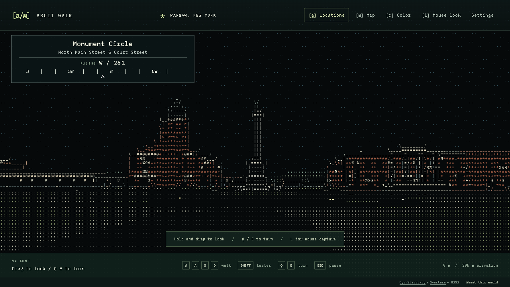
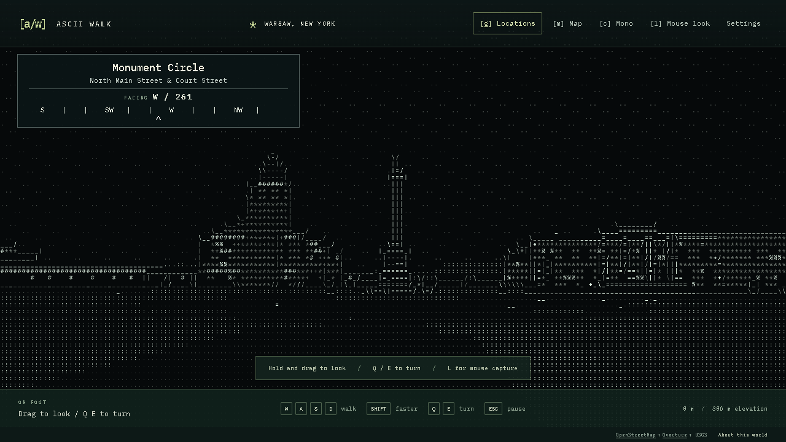
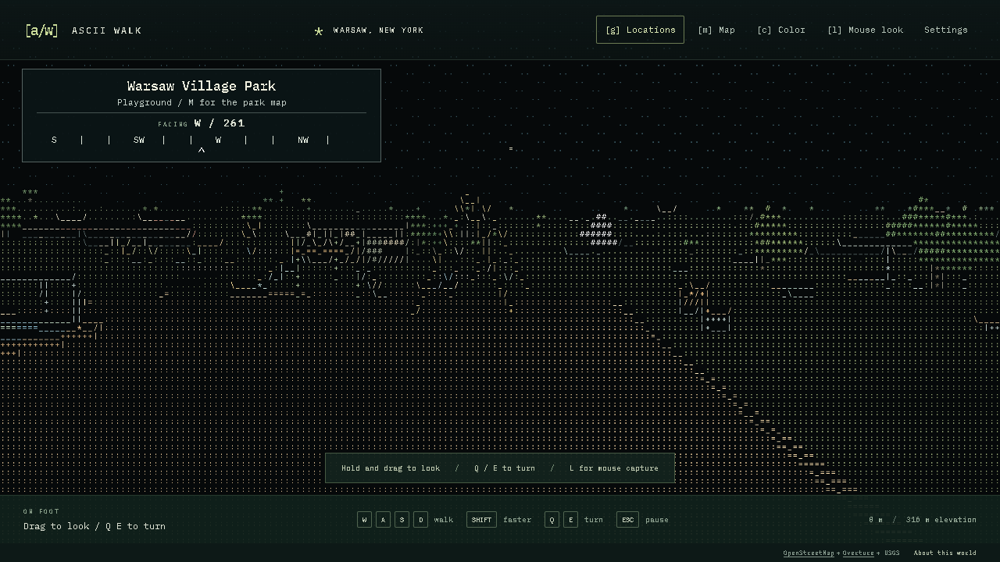

I wanted to explore a real place in a world made entirely of ASCII characters. Streets, buildings, people, cars, trees: all drawn with letters, numbers, and punctuation, with enough freedom to walk around and look wherever I wanted.

I had recently driven through Warsaw, New York, so it became the first test location. The question was simple: could I walk down a street in this version of Warsaw and think, "Hey, I recognize this"?

That became **ASCII Walk**, a browser-based exploration project built with TypeScript, Three.js, geographic data, and AI assistance from Codex.

**[Play ASCII Walk](https://mgelsinger.github.io/asciiwalk/) · [Browse the source and README](https://github.com/mgelsinger/asciiwalk)**

The demo starts facing the Civil War Monument. Use **WASD** to walk, **Q/E** or a mouse drag to turn, **G** to jump to another Warsaw location, and **C** to switch between color and monochrome. Playing requires a desktop or laptop with a keyboard and WebGL2-capable browser. If you are reading on your phone, the walkthrough below shows the experience.



## A real town needs more than a street grid

The first useful foundation was geographic: street alignments, building outlines, and changes in elevation. Those establish where you are, how roads meet, and how the landscape rises around you.

But the early version did not feel recognizable enough to me. The monument, courthouse, plaza, and the Main/Buffalo intersection needed to read more clearly. It was also harder to navigate than I wanted.

That feedback changed the priorities. Building silhouettes and frontage became more important. The monument needed its column and stepped base. The courthouse needed its projecting entrance and columns. Downtown needed the rhythm of connected storefronts and changing rooflines. Street names and a compass made it easier to connect the scene with a real place.

I wanted those shapes to work in monochrome too. Color can help separate surfaces, but removing it is a useful way to see whether the geometry, contrast, and outlines are doing enough.





The result is still an interpretation. Some building heights are estimates, architectural references include older photographs, and fine details disappear at character resolution. The project records those limitations alongside its [recognition notes](https://github.com/mgelsinger/asciiwalk/blob/main/docs/RECOGNITION.md).

## How the world becomes ASCII

There are two main stages: preparing the geography and rendering it in the browser.

The preparation tools use **Python** to turn bounded source data into a world pack. OpenStreetMap supplies street and building geometry. Matched Overture building data supplements some heights. Numeric USGS elevation supplies the terrain. Authored overrides add reference-informed details to selected Warsaw buildings.

The prepared world contains a manifest, feature data, and terrain grids. The browser loads those files and builds the scene using **Three.js**. Streets and buildings occupy real relative positions, and the walker follows the ground while colliding with buildings, water, and selected objects.

```text
Map geometry + heights + elevation
                |
         Prepared world files
                |
         Walkable 3D geometry
                |
      ASCII glyphs in the browser
```

The rendering step uses color, depth, surface information, and edges to choose a printable ASCII character for each cell. A second GPU pass draws those characters from a font atlas. The familiar dots, slashes, vertical bars, and dense symbols become pavement, rooflines, windows, foliage, and shadows.

The visible world is drawn with ASCII glyphs. The surrounding buttons and menus are regular browser UI. This approach provides free movement through a 3D scene while keeping the character-based appearance consistent across the town, people, and moving objects.

There is more detail in the [architecture notes](https://github.com/mgelsinger/asciiwalk/blob/main/docs/ARCHITECTURE.md), including terrain handling, collision, scene chunks, and the rendering passes.

## The park was a useful reality check

After adding a location picker, I could jump directly to the park and explore. That immediately exposed another problem: there were no basketball courts, swings, merry-go-round, or tennis courts to make it feel like the park I expected.

Filling those in changed the experience. Mapped recreation areas became courts, playgrounds, pools, and ball fields. Hoops, nets, court markings, slides, climbing frames, benches, picnic tables, and other furnishings added detail at walking height.



Movement helped too. Swings move, the merry-go-round turns, players use the courts, and water ripples. Nearby prompts let you interact with some equipment. A **Still** setting freezes activity, and the app respects a reduced-motion preference when choosing its initial setting.

The same attention then went into the other named destinations: school entrances and athletic grounds, the movie theater marquee and ticket window, shopping-center carts and parking, and details around the civic buildings and downtown shops.

These additions are approximate arrangements fitted to mapped places. They give you more to notice and interact with while exploring; the [park source notes](https://github.com/mgelsinger/asciiwalk/blob/main/docs/PARK.md) distinguish mapped facilities from inferred equipment and layouts.

## Making it easy to try

Free walking is useful, but walking across town should not be a prerequisite for seeing the interesting places. The location picker lets you arrive outside the monument, schools, shops, theater, park, and courthouse, then explore from there. Your position and preferences are saved in your browser.

Distribution also needed attention. Opening the source HTML directly in a browser did not load the app correctly, so the local version gained a launcher that starts a small server and opens the default browser. That is useful for development and for preparing new places.

For sharing, the simpler route is the **[hosted demo](https://mgelsinger.github.io/asciiwalk/)**. It includes Warsaw, Perry, and a section of downtown Buffalo, with no installation, account, or map API key required. The prepared geography and bundled font are served as static files. New-area preparation remains an optional local feature using Python and public data services, currently limited to the contiguous United States.

Build and unit-test checks run on Windows, macOS, and Linux. Browser checks cover walking, destination selection, saved state, interactions, and the standalone viewer. Warsaw's retained source snapshots can also reproduce the shipped world files. Those checks help make sharing repeatable, although browser and graphics performance still vary by device.

## Working with Codex

I used Codex to help plan and implement the project, work through the geography and rendering systems, add tests, and package the result for local use and the web.

My part was defining the experience and judging what came back. I picked Warsaw, prioritized recognizable streets and buildings, asked for monochrome and free walking, and pushed on the parts that were missing or difficult to use. The feedback was concrete: the landmarks needed to be clearer; I needed bearings and street names; the park needed its facilities; the other destinations needed the same attention.

That made iteration central to the work. Each playable version gave me something specific to evaluate, and those observations shaped the next changes. Getting a scene on screen was one milestone. Making it feel familiar and inviting enough to explore took repeated review.

## Take a walk

The project is ready to try. Start at the monument, turn toward the courthouse, jump to Main Street, or spend a little time in the park. Switch off the color and see which shapes still stand out.

If you know Warsaw, I would especially like to hear which places you recognize and which details are missing. Screenshots, a location name, and a description of what looks wrong are useful feedback through the [issue tracker](https://github.com/mgelsinger/asciiwalk/issues).

**[Explore ASCII Walk](https://mgelsinger.github.io/asciiwalk/)**

*Media in this article was captured from the running project. Geographic sources include OpenStreetMap contributors, applicable Overture and Microsoft building data, and USGS 3DEP. The place-name index uses GeoNames, and the font is IBM Plex Mono. Source attribution, reference information, and applicable licenses are retained in the project's [data and asset notices](https://github.com/mgelsinger/asciiwalk/blob/main/public/DATA_LICENSES.txt). The repository includes the source for inspection and testing; an application-code reuse license has not yet been selected.*
