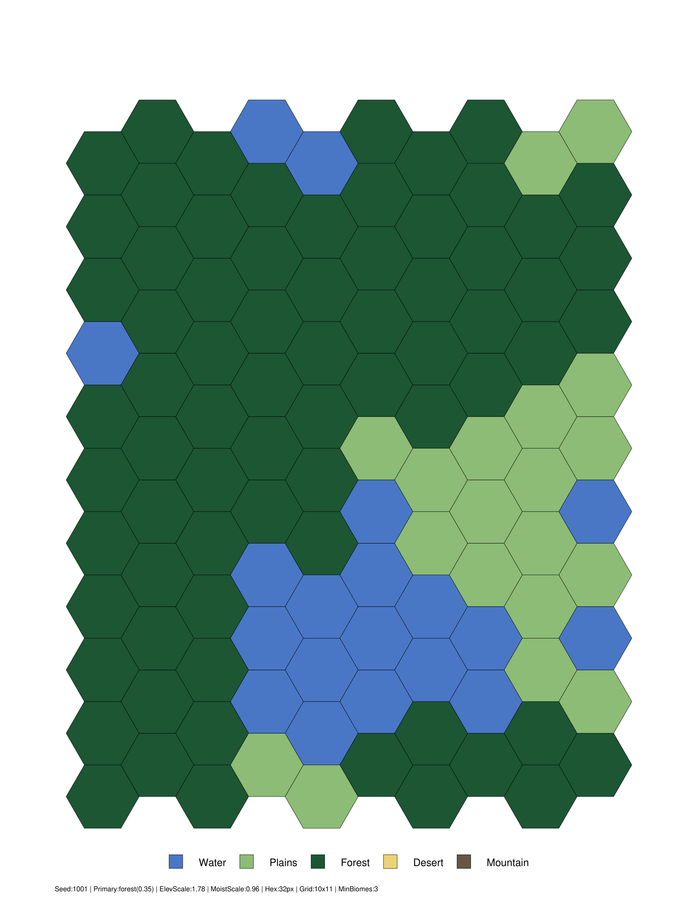
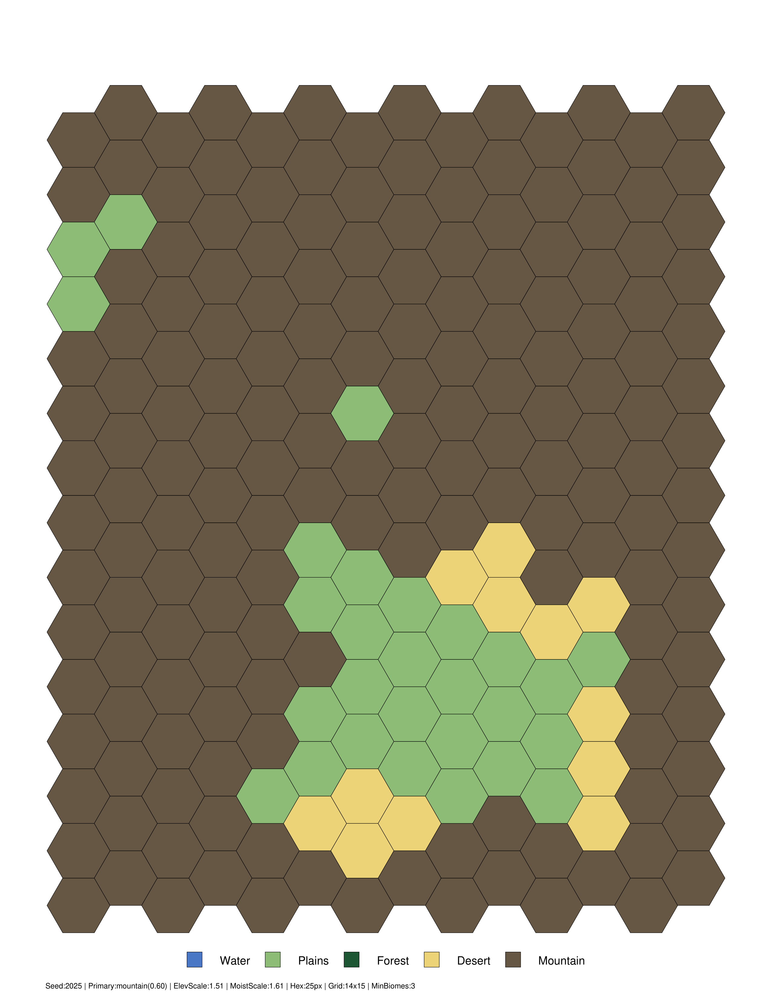
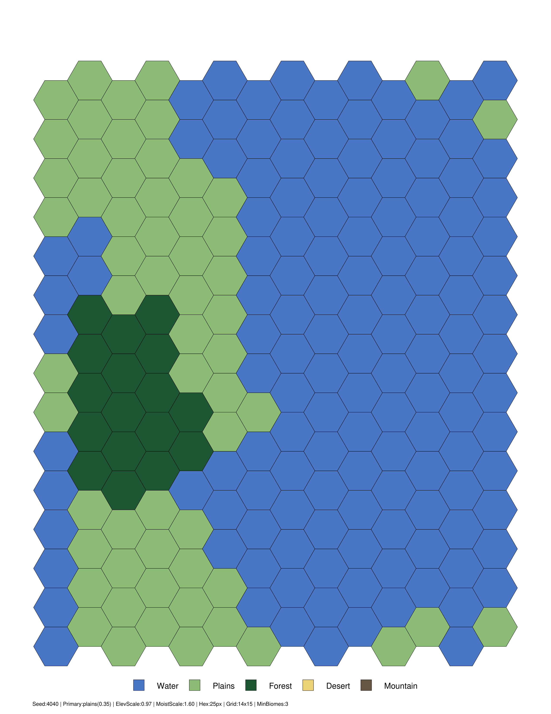

## TL;DR
**MapGen** is a tiny Python tool that generates **hex-grid maps** using dual **Perlin noise** (elevation + moisture), assigns **biomes** (water, plains, forest, desert, mountain), and exports a **centered, printable PDF** (US-Letter). It’s handy for tabletop one-shots, board-game prototyping, classrooms, or just noodling with procedural terrain. Repo: `github.com/mgelsinger/mapgen`.

---

## Why I built this
I like tools that are *boringly reliable* and *visually useful*. I wanted a single-command way to produce clean hex boards, tweak the “feel” (e.g., forest-heavy, mountain-heavy), and print without fiddling with assets or layout. A small CLI + PDF output hits that sweet spot.

---

## What it does
- **Procedural terrain:** Dual Perlin noise fields → elevation & moisture → biome assignment.  
- **Bias controls:** Tilt toward plains/forest/desert/mountain to get the vibe you want.  
- **Diversity guardrails:** Avoid monotone outputs by requiring a minimum number of biome types.  
- **PDF export:** Grid + legend centered on US-Letter; no external assets.

---

## How it works (quick tour)
- **Noise:** Uses `noise.pnoise2` to generate elevation/moisture layers.  
- **Classification:** Thresholds + a primary-biome bias map select each hex’s biome.  
- **Adjacency cleanup:** Simple constraints reduce unlikely borders and isolated tiles.  
- **Render:** Draws the grid and legend with ReportLab, centered with margins for clean printing.

---

## Install & run

```bash
# Clone
git clone https://github.com/mgelsinger/mapgen.git
cd mapgen

# (Optional) venv
python -m venv .venv
# Windows
. .venv\Scripts\activate
# macOS/Linux
# source .venv/bin/activate

# Install deps (Python 3.10+)
python -m pip install -r requirements.txt

# Generate a default map (writes a timestamped PDF in the current directory)
python hex_map_generator.py
```

You should see a file like: `hex_map_YYYYMMDD_HHMMSS_<seed>.pdf`. Print at **100% scale** (no “fit to page”).

### Useful options

```bash
# Show all flags
python hex_map_generator.py -h

# Forest-biased map
python hex_map_generator.py --bias forest

# Strong mountain bias + reproducible seed
python hex_map_generator.py --bias mountain --bias-strength 0.6 --seed 12345

# Larger hexes and margins
python hex_map_generator.py --hex-size 32 --margin 48

# Encourage variety: require ≥ 3 distinct biomes
python hex_map_generator.py --min-biomes 3
```

Key flags you’ll likely tweak:
- `--hex-size <int>` — hex radius (points); default `25`  
- `--margin <int>` — page margin (points); default `36`  
- `--legend-size <int>` — legend swatch size (points); default `12`  
- `--bias {plains,forest,desert,mountain}` — primary biome bias  
- `--bias-strength <float>` — bias intensity; default `0.35`  
- `--min-biomes <int>` — minimum biome count; default `3`  
- `--seed <int>` — reproducible output  
- `--attempts <int>` — max retries to meet diversity; default `5`

---

## Gallery








---

## Troubleshooting
- **`ModuleNotFoundError: noise` or `reportlab`:** Re-run `pip install -r requirements.txt`.  
- **Wrong Python:** Ensure `python --version` is **3.10+**.  
- **Print scaling looks off:** Print at **100%** (disable “fit to page”).

---

## Roadmap (lightweight)
- CLI flags for **page size** (A4/Letter) and **orientation**.  
- Optional **SVG** export for vector pipelines.  
- A tiny **web demo** that calls the generator and shows thumbnails.  
- Tuning presets (e.g., *Coastal Maps*, *Inland Highlands*).

---

## Collaborators
If your team builds tools around **procedural content, mapping/visualization, education, or simulation**, I’m happy to connect. I enjoy bringing reliable tooling to creative workflows.

---

