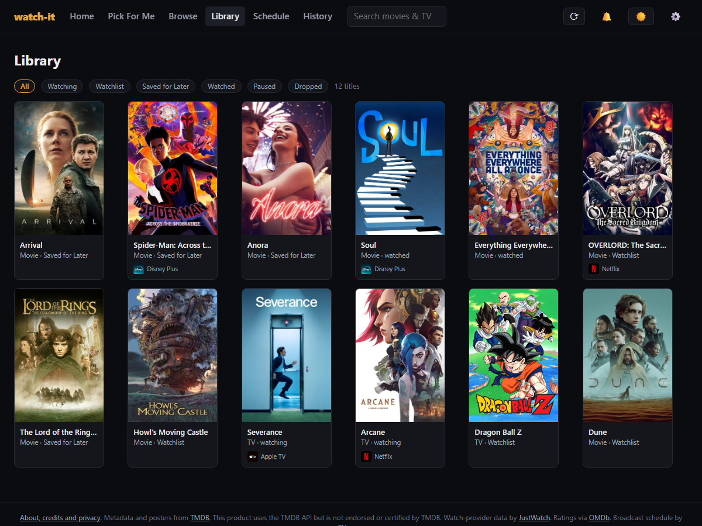
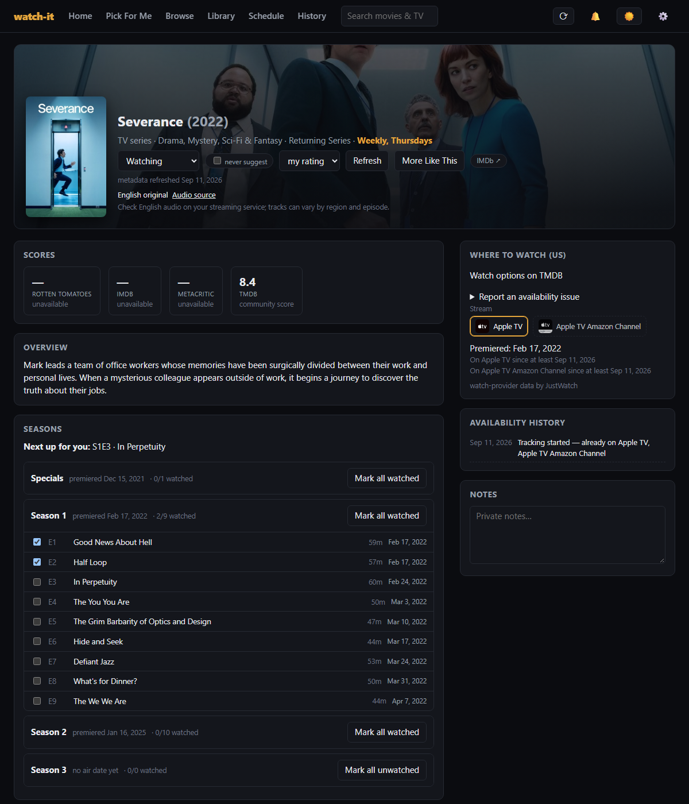
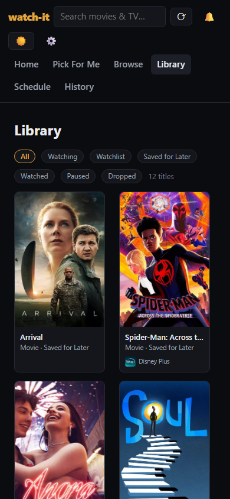

Having something to watch and deciding what to watch are two different problems. Add a few streaming subscriptions and several unfinished shows, and there is another question waiting afterward: where did I leave off?

I wanted one place to handle both. That became **Watch It**, a self-hosted movie and TV discovery and watch-tracking app. The idea is simple: **find your next watch and keep your place**.

The first community release, **v1.0.0**, is now available. You run it on your own computer or home server, choose your streaming services, find a suggestion, and keep your watchlist and episode progress together.

**[Download Watch It](https://github.com/mgelsinger/watch-it/releases/tag/v1.0.0) · [Read the setup guide and source](https://github.com/mgelsinger/watch-it#readme)**

Watch It does not host, play, or download video. You do not need video files, and you never give it your streaming-service passwords. Actual playback happens on the service you already use.

*The screenshots in this post show the real app with a curated sample library. Saved titles and watched progress are illustrative. Artwork and regional offers came from TMDB at capture time, so the screenshots are not a current availability listing.*

## Start with the evening you have

The main demonstration is a small, familiar request:

> I have 45 minutes, these streaming subscriptions, and want something light.

In **Pick For Me**, choose **45 min**, **TV show** or **Either**, and **Light / comedy**. Open **Choose your streaming services**, select your subscriptions, and leave **Only show services I already use** checked. Your country in Settings determines which regional offers the app checks.

The recommendation at the top of this post shows the result: a title, a synopsis, a listed runtime, and a **Why this fits** explanation. In that sample, Ted Lasso has a 33-minute first episode, a comedy classification, and a listed US Apple TV offer at the time of capture.

Those details matter more to me than an unexplained recommendation score. I can see what matched, decide whether the suggestion appeals, and shuffle if it does not. I can also preview the title without adding it, put it on my Watchlist, save it for later, or tell Watch It not to suggest it again.

There are limits to what those reasons mean. Comedy is a catalog genre, so it cannot guarantee a light tone. A first-episode runtime does not describe every episode. Recommendations use a limited catalog sample and simple ranking; they are not a promise of the best possible choice. When the available data does not support a match, the app offers ways to adjust the filters.

## Find it, save it, then keep your place

**Watch options on TMDB** opens the regional provider listing, where you can follow a service link. Availability, subscription plans, and audio tracks still need to be confirmed on the actual service.

Once a title looks interesting, it can stay in your library alongside shows you are watching and things you want to leave for later.

*A populated sample library keeps saved movies and shows in progress together. Service badges reflect the captured regional data.*

Episode tracking is manual. Mark an episode watched, and the title page keeps track of what is next. The example below has two episodes of Severance marked watched and points to the third.

*The episode list and watch options share the title page. Opening a streaming service does not automatically mark anything watched.*

The layout also adapts to a smaller browser, which is useful when you want to check your place from the couch. Access from another device needs the documented home-network setup; a phone's `localhost` points to the phone itself.

*A narrow-browser view of the sample library. The release checks include mobile-sized Chromium views, rather than certification on every phone or browser.*

## Why make another watch app?

[JustWatch](https://www.justwatch.com/) already helps people find streaming availability. [Trakt](https://trakt.tv/) and other watch-tracking apps already organize viewing history. Those are useful alternatives, particularly if you would rather use an established hosted service without installing anything.

Watch It's appeal is the combination I wanted to use: a time-and-services suggestion, a decision about what to save, and visible episode progress in one self-hosted library. Your library stays in your installation, and you can export your lists, notes, ratings, preferences, and watched progress. Metadata requests still go to external providers.

There is also a useful distinction from [Jellyfin](https://jellyfin.org/), which is a personal media server for organizing and playing video files. Watch It helps with discovery and tracking around streaming subscriptions. It does not replace a media server or a streaming subscription.

For this release, I chose to focus on self-hosting. **Each installation has one shared library, including progress and settings.** An optional installation password protects access to that library; it does not create separate accounts or private libraries for different people.

## Trying it yourself

The easiest installation path is the [v1.0.0 release bundle](https://github.com/mgelsinger/watch-it/releases/tag/v1.0.0). Download `watch-it-1.0.0-linux-amd64.zip` and `checksums.txt`, verify the checksum, extract the ZIP, and follow `START_HERE.md`.

You need Docker with Compose and your own TMDB API key. The app links to TMDB's key application from **Settings > API keys**, where you paste the key and select **Verify and save TMDB key**. OMDb is optional if you want additional ratings. You do not need Git, Node.js, Python, or a source build for the installation bundle.

The verified container platform is Linux x86-64, including Docker Desktop on Windows using Linux containers. ARM and Apple Silicon are not yet verified. The [installation guide](https://github.com/mgelsinger/watch-it/blob/main/docs/INSTALL.md) covers setup and troubleshooting, and the [operations guide](https://github.com/mgelsinger/watch-it/blob/main/docs/OPERATIONS.md) covers backups, upgrades, and access from other devices.

There is also a [standalone sample demo](https://github.com/mgelsinger/watch-it/blob/main/web/public/demo/index.html?raw=true) you can download and open in a browser before installing. Unlike the screenshots here, that demo uses fictional titles, artwork, and availability. It needs no Docker, account, or API key, makes no API calls, and keeps its sample progress only in temporary browser memory. It is a way to try the workflow, not a live catalog.

## Getting it ready to share

I used Codex to help develop Watch It and prepare this release, including the app copy, first-use experience, recommendation flow, installation bundle, and checks. My priorities were practical: make the purpose clear, make the 45-minute example understandable, and preserve the library when updating the app.

Release preparation included clean installations, backup and restore checks, desktop and mobile browser checks, and an upgrade of my existing installation. That upgrade started with a full backup and a rehearsal on an isolated copy. The checks confirmed that the library and watched progress survived the migration. The [release page](https://github.com/mgelsinger/watch-it/releases/tag/v1.0.0) includes the tested download, checksums, verification reports, and known limits.

I would like feedback from people who try self-hosting it: where setup is confusing, whether Pick For Me helps you decide, and whether keeping episode progress feels useful. The [issue tracker](https://github.com/mgelsinger/watch-it/issues) is open. Include the region and title when reporting an availability problem, and leave keys, backups, and private notes out of reports.

**[Get Watch It v1.0.0](https://github.com/mgelsinger/watch-it/releases/tag/v1.0.0)**

*Watch It's application code is MIT licensed. Screenshot artwork and metadata come from TMDB, with watch-provider data from JustWatch through TMDB. This application uses TMDB and the TMDB APIs but is not endorsed, certified, or otherwise approved by TMDB. Optional ratings come from OMDb, and broadcast schedules from TVmaze. Provider data and artwork have their own terms; see the project's [attribution details](https://github.com/mgelsinger/watch-it/blob/main/docs/ATTRIBUTION.md).*
